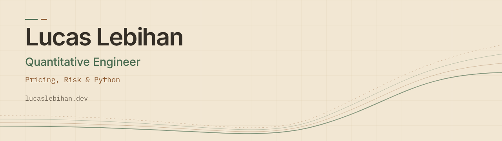

<picture>
  <source media="(prefers-color-scheme: dark)" srcset="assets/profile-dark.png">
  <source media="(prefers-color-scheme: light)" srcset="assets/profile-light.png">
  
</picture>

# Lucas Lebihan

**Quantitative Engineer · Pricing, Risk & Python**

I build software for quantitative finance: numerical models, Python APIs,
market-data pipelines and interactive tools. My projects connect financial
concepts with the engineering needed to test, explain and operate them.

**[Portfolio](https://lucaslebihan.dev/en/)**
· **[LinkedIn](https://www.linkedin.com/in/lucascjlebihan)**
· **[Try the interactive option-pricing lab](https://pricing.lucaslebihan.dev/)**
· **[Contact me](mailto:contact@lucaslebihan.dev)**

## Selected projects

| Project | What it does | Engineering focus |
| --- | --- | --- |
| [Option Model Lab](https://github.com/HtFilia/option-model-lab) | Interactive exploration and calibration of option-pricing models | React/TypeScript, Python numerics, documented browser/API computation boundaries |
| [DeltaCore](https://github.com/HtFilia/DeltaCore) | European option pricing, Greeks, implied volatility and risk analytics | Pure numerical kernels, typed FastAPI boundaries, reference and invariant tests |
| [TickerFlow](https://github.com/HtFilia/tickerflow) | Local OHLCV ingestion, quality reports, Parquet storage and time bars | Explicit schemas, UTC time conventions, Polars/DuckDB and query APIs |
| [TradeOps](https://github.com/HtFilia/tradeops) | Simulated market data and order execution with a React dashboard | Asynchronous Python services, Redis streams, PostgreSQL and integration tests |
| [Dotfiles](https://github.com/HtFilia/dotfiles) | Reproducible workstation and Debian VPS environments | Bash/Chezmoi profiles, pinned downloads, recovery snapshots and cross-platform CI |

## Where to start

- **Quantitative development:** [DeltaCore's numerical validation](https://github.com/HtFilia/DeltaCore#numerical-validation)
  covers pricing references, put-call parity, finite-difference Greeks and calibration.
- **Data engineering:** [TickerFlow's implemented workflow](https://github.com/HtFilia/tickerflow#current-vertical-slice)
  follows local CSV data through validation, storage and querying.
- **Application architecture:** [Option Model Lab's computation boundaries](https://github.com/HtFilia/option-model-lab/blob/main/docs/COMPUTATION_BOUNDARIES.md)
  explain which calculations run in the browser and which use the API.
- **Operational engineering:** [Dotfiles' design decisions](https://github.com/HtFilia/dotfiles#design-decisions)
  explain profile separation, verification and recovery.

## How I approach the work

- Keep numerical assumptions, units and model limitations explicit.
- Separate domain logic from HTTP, storage and user interfaces.
- Test against references and failure cases, with deterministic local fixtures.
- Document what works today, what remains experimental and how to reproduce it.

These are personal engineering projects. Option Model Lab is educational,
TradeOps uses simulated market data, and TickerFlow currently works with local
fixtures. Each repository documents its implemented scope and limitations.

For quantitative development or financial engineering opportunities, or a
discussion about the projects:
[contact@lucaslebihan.dev](mailto:contact@lucaslebihan.dev).
